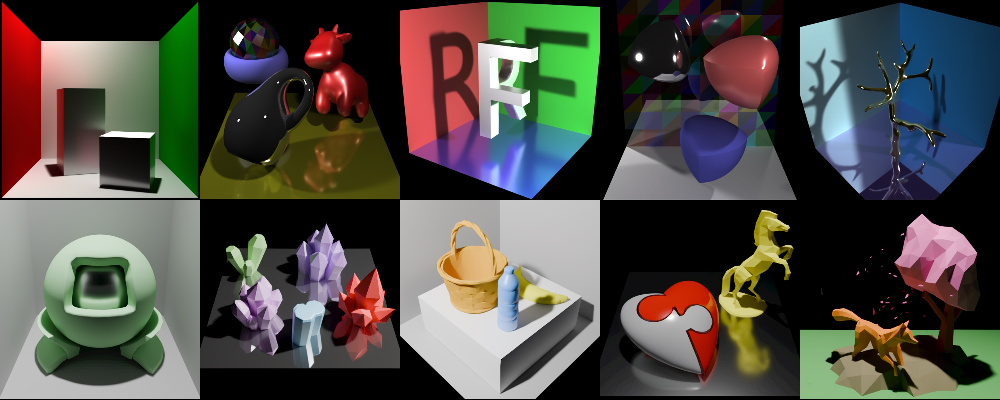

<p align="center">

  <div align="center">
    
  </div>

  <h1 align="center">RenderFormer: Transformer-based Neural Rendering of Triangle Meshes with Global Illumination</h1>
  <p align="center">
    <a href="https://www.chong-zeng.com/"><strong>Chong Zeng</strong></a>
    ·
    <a href="https://yuedong.shading.me/"><strong>Yue Dong</strong></a>
    ·
    <a href="https://www.cs.wm.edu/~ppeers/"><strong>Pieter Peers</strong></a>
    ·
    <a href="https://svbrdf.github.io/"><strong>Hongzhi Wu</strong></a>
    ·
    <a href="https://scholar.google.com/citations?user=P91a-UQAAAAJ&hl=en"><strong>Xin Tong</strong></a>
  </p>
  <h2 align="center">SIGGRAPH 2025 Conference Papers</h2>

  <div align="center">
    
    Examples of triangle-mesh based scenes rendered with RenderFormer without per-scene training or fine-tuning that include (multiple) specular reflections, complex shadows, diffuse indirect lighting, glossy reflections, soft and hard shadows, and multiple light sources.
  </div>

  <p align="center">
  <br>
    <a href="https://microsoft.github.io/renderformer/"><strong>Project Page</strong></a>
    |
    <a href="https://renderformer.github.io/pdfs/renderformer-paper.pdf"><strong>Paper</strong></a>
    |
    <a href="https://huggingface.co/microsoft/renderformer-v1.1-swin-large"><strong>Model</strong></a>
    |
    <a href="https://github.com/microsoft/renderformer"><strong>Official Code</strong></a>
  </p>
</p>

RenderFormer is a neural rendering pipeline that directly renders an image from a triangle-based representation of a scene with full global illumination effects and that does not require per-scene training or fine-tuning. Instead of taking a physics-centric approach to rendering, we formulate rendering as a sequence-to-sequence transformation where a sequence of tokens representing triangles with reflectance properties is converted to a sequence of output tokens representing small patches of pixels. RenderFormer follows a two stage pipeline: a view-independent stage that models triangle-to-triangle light transport, and a view-dependent stage that transforms a token representing a bundle of rays to the corresponding pixel values guided by the triangle-sequence from the the view-independent stage. Both stages are based on the transformer architecture and are learned with minimal prior constraints. We demonstrate and evaluate RenderFormer on scenes with varying complexity in shape and light transport.

# Table of Content

- [Installation](#installation)
  * [Prerequisites](#prerequisites)
  * [Environment Setup](#environment-setup)
  * [Pretrained Models](#pretrained-models)
- [Usage](#usage-1)
  * [Image Rendering](#image-rendering)
    + [Scene Conversion](#scene-conversion)
    + [Rendering a Single Image Using Inference Script](#rendering-a-single-image-using-inference-script)
      - [Available Arguments of the Inference Script](#available-arguments-of-the-inference-script)
    + [Inference with `RenderFormerRenderingPipeline`](#inference-with--renderformerrenderingpipeline-)
  * [Video Rendering](#video-rendering)
    + [Download Example Data](#download-example-data)
    + [Rendering a Video Using Inference Script](#rendering-a-video-using-inference-script)
      - [Available Arguments of the Inference Script](#available-arguments-of-the-inference-script-1)
- [Bring Your Own Scene!](#bring-your-own-scene-)
  * [Scene Definition JSON](#scene-definition-json)
    + [Scene Structure](#scene-structure)
    + [Object Configuration](#object-configuration)
    + [Camera Configuration](#camera-configuration)
    + [Example Scene](#example-scene)
    + [HDF5 Data Fields](#hdf5-data-fields)
    + [Remesh Objects](#remesh-objects)
  * [Blender Extension](#blender-extension)
  * [Scene Setting Tips](#scene-setting-tips)
- [Acknowledgements](#acknowledgements)
- [License](#license)
- [Citation](#citation)

# Installation

## Prerequisites

- **System**: The code is tested on **Linux**, **MacOS** and **Windows**.
- **Hardware**: The code has been tested on both **NVIDIA CUDA GPUs** and **Apple Metal GPUs**. The minimal GPU memory requirement is 8GB.

## Environment Setup

First set up an environment with PyTorch 2.0+. For CUDA users, you can install Flash Attention from https://github.com/Dao-AILab/flash-attention.

The rest of the dependencies can be installed through:

```bash
git clone https://github.com/microsoft/renderformer
cd renderformer
pip install -r requirements.txt
python3 -c "import imageio; imageio.plugins.freeimage.download()"  # Needed for HDR image IO
```

## Pretrained Models

| Model | Params | Link | Model ID |
|-------|--------|------|----------|
| RenderFormer-V1-Base | 205M | [Hugging Face](https://huggingface.co/microsoft/renderformer-v1-base) | `microsoft/renderformer-v1-base` |
| RenderFormer-V1.1-Large | 483M | [Hugging Face](https://huggingface.co/microsoft/renderformer-v1.1-swin-large) | `microsoft/renderformer-v1.1-swin-large` |

<details>
<summary>Note on the released models</summary>
<br>
We found a shader bug in the training data that we used in the submission. We re-trained the models with the corrected shader and released the new models. Thus the model performance and output might be different from the results in the paper.
</details>

# Usage

## Image Rendering

### Scene Conversion

We put example scene config JSON files at [`examples`](./examples). To render a scene, first convert a scene config JSON file into our HDF5 scene format:

```bash
python3 scene_processor/convert_scene.py examples/cbox.json --output_h5_path tmp/cbox/cbox.h5
```

### Rendering a Single Image Using Inference Script

```bash
python3 infer.py --h5_file tmp/cbox/cbox.h5 --output_dir output/cbox/
```

You should now see `output/cbox/cbox_view_0.exr` and `output/cbox/cbox_view_0.png` under your output folder. `.exr` is the HDR Linear output from RenderFormer, and `.png` is the LDR version of the rendered image. You can enable different tone mappers through `--tone_mapper` to achieve better visual results.

The script will automatically fallback to use torch scaled dot product attention if Flash Attention is not found on the system. We also provide an environment `ATTN_IMPL` for you to choose which attention implementation to use:

```bash
# Use SDPA intentionally
ATTN_IMPL=sdpa python3 infer.py --h5_file tmp/cbox/cbox.h5 --output_dir output/cbox/
```

Please check the [image render shell script](./render-images.sh) for more examples.

#### Available Arguments of the Inference Script

```bash
--h5_file H5_FILE     Path to the input H5 file
--model_id MODEL_ID   Model ID on Hugging Face or local path
--precision {bf16,fp16,fp32}
                      Precision for inference (Default: fp16)
--resolution RESOLUTION
                      Resolution for inference (Default: 512)
--output_dir OUTPUT_DIR
                      Output directory (Default: same as input H5 file)
--tone_mapper {none,agx,filmic,pbr_neutral}
                      Tone mapper for inference (Default: none)
```

### Inference with `RenderFormerRenderingPipeline`

You can achieve batch rendering with `RenderFormerRenderingPipeline` by providing a batch of input scene and rendering camera parameters.

Minimal example (without meaningful inputs, just for testing):

```python
import torch
from renderformer import RenderFormerRenderingPipeline

pipeline = RenderFormerRenderingPipeline.from_pretrained("microsoft/renderformer-v1.1-swin-large")
device = torch.device('cuda')
pipeline.to(device)

BATCH_SIZE = 2
NUM_TRIANGLES = 1024
TEX_PATCH_SIZE = 32
NUM_VIEWS = 4

triangles = torch.randn((BATCH_SIZE, NUM_TRIANGLES, 3, 3), device=device)
texture = torch.randn((BATCH_SIZE, NUM_TRIANGLES, 13, TEX_PATCH_SIZE, TEX_PATCH_SIZE), device=device)
mask = torch.ones((BATCH_SIZE, NUM_TRIANGLES), dtype=torch.bool, device=device)
vn = torch.randn((BATCH_SIZE, NUM_TRIANGLES, 3, 3), device=device)
c2w = torch.randn((BATCH_SIZE, NUM_VIEWS, 4, 4), device=device)
fov = torch.randn((BATCH_SIZE, NUM_VIEWS, 1), device=device)

rendered_imgs = pipeline(
    triangles=triangles,
    texture=texture,
    mask=mask,
    vn=vn,
    c2w=c2w,
    fov=fov,
    resolution=512,
    torch_dtype=torch.float16,
)
print("Inference completed. Rendered Linear HDR images shape:", rendered_imgs.shape)
# Inference completed. Rendered Linear HDR images shape: torch.Size([2, 4, 512, 512, 3])
```

Please check [`infer.py`](./infer.py) and [`rendering_pipeline.py`](./renderformer/pipelines/rendering_pipeline.py) for detailed usages.

## Video Rendering

### Download Example Data

We put example video input data on [Hugging Face](https://huggingface.co/datasets/renderformer/renderformer-video-data). You can download and unzip them with [this script](./download_video_data.sh).

### Rendering a Video Using Inference Script

```bash
python3 batch_infer.py --h5_folder renderformer-video-data/submission-videos/cbox-roughness/ --output_dir output/videos/cbox-roughness
```

Please check the [video render shell script](./render-videos.sh) for more examples.

#### Available Arguments of the Inference Script

```bash
--h5_folder H5_FOLDER
                      Path to the folder containing input H5 files
--model_id MODEL_ID   Model ID on Hugging Face or local path
--precision {bf16,fp16,fp32}
                      Precision for inference
--resolution RESOLUTION
                      Resolution for inference
--batch_size BATCH_SIZE
                      Batch size for inference
--padding_length PADDING_LENGTH
                      Padding length for inference
--num_workers NUM_WORKERS
                      Number of workers for data loading
--output_dir OUTPUT_DIR
                      Output directory for rendered images (default: same as input folder)
--save_video          Merge rendered images into a video at video.mp4.
--tone_mapper {none,agx,filmic,pbr_neutral}
                      Tone mapper for inference
```

# Bring Your Own Scene!

## Scene Definition JSON

RenderFormer uses a JSON-based scene description format that defines the geometry, materials, lighting, and camera setup for your scene. The scene configuration is defined using a hierarchical structure with the following key components:

### Scene Structure

- `scene_name`: A descriptive name for your scene
- `version`: The version of the scene description format (currently "1.0")
- `objects`: A dictionary of objects in the scene, including both geometry and lighting
- `cameras`: A list of camera configurations for rendering

### Object Configuration

Each object in the scene requires:

- `mesh_path`: Path to the .obj mesh file
- `material`: Material properties including:
  - `diffuse`: RGB diffuse color [r, g, b]
  - `specular`: RGB specular color [r, g, b] (We currently only support white specular, and diffuse + specular should be no larger than 1.0)
  - `roughness`: Surface roughness (0.01 to 1.0)
  - `emissive`: RGB emission color [r, g, b] (We currently only support white emission, and only on light source triangles)
  - `smooth_shading`: Whether to use smooth shading on this object
  - `rand_tri_diffuse_seed`: Optional seed for random triangle coloring, if none, use the diffuse color directly
  - `random_diffuse_max`: Maximum value for random diffuse color assignment (max diffuse color + specular color should be no larger than 1.0)
  - `random_diffuse_type`: Type of random diffuse color assignment, either per triangle or per shading group
- `transform`: Object transformation including:
  - `translation`: [x, y, z] position
  - `rotation`: [x, y, z] rotation in degrees
  - `scale`: [x, y, z] scale factors
  - `normalize`: Whether to normalize object to unit sphere
- `remesh`: Whether to remesh the object
- `remesh_target_face_num`: Target face number of the remeshed object

### Camera Configuration

Each camera requires:

- `position`: [x, y, z] camera position
- `look_at`: [x, y, z] target point
- `up`: [x, y, z] up vector
- `fov`: Field of view in degrees

### Example Scene

We recommend start from the `examples/init-template.json` and modify it to your needs. For more complex examples, refer to the scene configurations in the `examples` directory.

### HDF5 Data Fields

The HDF5 file contains the following fields:

- `triangles`: [N, 3, 3] array of triangle vertices
- `texture`: [N, 13, 32, 32] array of texture patches
- `vn`: [N, 3, 3] array of vertex normals
- `c2w`: [N, 4, 4] array of camera-to-world matrices
- `fov`: [N] array of field of view

We use the same camera coordinate system as Blender (-Z = view direction, +Y = up, +X = right), be mindful of the coordinate system when implementing your own HDF5 converter.

Please refer to [`scene_processor/to_h5.py`](./scene_processor/to_h5.py) for more details.

### Remesh Objects

We provide a simple remeshing tool in [`scene_processor/remesh.py`](./scene_processor/remesh.py). You can use it to remesh your objects before putting them into the scene.

We also provide fields in the scene config JSON file (`remesh` and `remesh_target_face_num`) to allow you to remesh the object during scene conversion process.

```bash
python3 scene_processor/remesh.py --input path/to/your/high_res_mesh.obj ----output remeshed_object.obj --target_face_num 1024
```

## Blender Extension

We provide a Blender Extension to simplify the process of setting up a scene for RenderFormer. Please refer to the [Blender Extension](https://github.com/iamNCJ/renderformer-blender-extension) for more details.

## Scene Setting Tips

1. Always start from the `examples/init-template.json`.
2. Please limit the scene in our training data range, extrapolation can work but not guaranteed.
   - Camera distance to scene center in [1.5, 2.0], fov in [30, 60] degrees
   - Scene bounding box in [-0.5, 0.5] in x, y, z
   - Light sources: up to 8 triangles (please use the triangle mesh at [`examples/templates/lighting/tri.obj`](./examples/templates/lighting/tri.obj)), each scale in [2.0, 2.5], distance to scene center in [2.1, 2.7], emission values summed in [2500, 5000]
   - Total number of triangles: training data covers up to 4096 triangles, but extending to 8192 triangles during inference usually still works.
   - All training objects are water-tight and simplified with QSlim. Uniform triangle sizes are preferred. If you find your object not working, try to remesh it with our provided script or other remeshing tools.

# Acknowledgements

We borrowed some code from the following repositories. We thank the authors for their contributions.

- [DPT](https://github.com/isl-org/DPT/)
- [nerfstudio](https://github.com/nerfstudio-project/nerfstudio/)
- [rotary-embedding-torch](https://github.com/lucidrains/rotary-embedding-torch)

In addition to the 3D model from [Objaverse](https://objaverse.allenai.org/), we express our profound appreciation to the contributors of the 3D models that we used in the examples.

- [**Shader Ball**](https://rgl.s3.eu-central-1.amazonaws.com/scenes/matpreview.zip): by Wenzel Jakob from [Mitsuba Gallery](https://mitsuba.readthedocs.io/en/stable/src/gallery.html)
- **Stanford Bunny & Lucy**: from [The Stanford 3D Scanning Repository](https://graphics.stanford.edu/data/3Dscanrep/)
- **Cornell Box**: from [Cornell Box Data, Cornell University Program of Computer Graphics](https://www.graphics.cornell.edu/online/box/)
- **Utah Teapot**: from [Utah Model Repository](https://users.cs.utah.edu/~dejohnso/models/teapot.html)
- **Veach MIS**: From Eric Veach and Leonidas J. Guibas. 1995. Optimally combining sampling techniques for Monte Carlo rendering
- **Spot**: By Keenan Crane from [Keenan's 3D Model Repository](https://www.cs.cmu.edu/~kmcrane/Projects/ModelRepository/)
- [**Klein Bottle**](https://sketchfab.com/3d-models/klein-bottle-ce95eaceb29544aaa47db7a586811b09): By Fausto Javier Da Rosa 
- **Constant Width**: Original mesh from [Small volume bodies of constant width](https://arxiv.org/abs/2405.18501). Derived mesh from [Keenan's 3D Model Repository](https://www.cs.cmu.edu/~kmcrane/Projects/ModelRepository/)
- [**Jewelry**](https://sketchfab.com/3d-models/jewelry-4373121e41f94727bb802b78ce6b566f): By elbenZ
- [**Banana**](https://sketchfab.com/3d-models/banana-923ea2b1927d4c24ab88860ee416ce6c), [**Easter Basket**](https://sketchfab.com/3d-models/easter-basket-427232bfdd344c46ab878c4bfcb8f904), [**Water Bottle**](https://sketchfab.com/3d-models/water-bottle-c002e2aa017d49ae8e6dbd295cca3914), [**Bronco**](https://sketchfab.com/3d-models/bronco-37e3760bfde44beeb39e6fd69b690637), [**Heart**](https://sketchfab.com/3d-models/heart-puzzle-e762b2d7de6749e79f54e0e6a0ff96be): By Microsoft
- [**Lowpoly Fox**](https://sketchfab.com/3d-models/lowpoly-fox-01674a892f414c0681afdeb563cc8e13): By Vlad Zaichyk
- [**Lowpoly Crystals**](https://sketchfab.com/3d-models/lowpoly-crystals-d94bccb1305d409482eba04d736fb7dd): By Mongze
- [**Bowling Pin**](https://sketchfab.com/3d-models/bowling-pin-e0be50c74a4a479f8d412a4050f8fe05): By SINOFWRATH
- [**Cube Cascade**](https://sketchfab.com/3d-models/cube-cascade-11ba2667998d45f8b3ad178b27a34725), [**Marching Cubes**](https://sketchfab.com/3d-models/marching-cubes-4d2a15a193764305875c62bd5dff757d): By Tycho Magnetic Anomaly
- [**Dancing Crab**](https://sketchfab.com/3d-models/dancing-crab-uca-mjoebergi-280863886fee409ab3c8168f07caa89f): By Bohdan Lvov
- [**Magical Gyroscope**](https://sketchfab.com/3d-models/magical-gyroscope-a3f110c0d2944a2dbff78709eb8f3984): By reddification
- [**Capoeira Cube**](https://sketchfab.com/3d-models/capoeira-cube-753c8e3fdab64478b497fc5c6d8c88d9): By mortaleiros
- [**P.U.C. Security Bot**](https://sketchfab.com/3d-models/puc-security-bot-7-ee0a6da142b94d2bbf1d65526bec3d3e): By Gouhadouken

# License

RenderFormer model and the majority of the code are licensed under the MIT License. The following submodules may have different licenses:

- [renderformer-liger-kernel](https://github.com/iamNCJ/renderformer-liger-kernel): Redistributed Liger Kernel for RenderFormer integration. It's derived from original [Liger Kernel](https://github.com/linkedin/Liger-Kernel) and licensed under the BSD 2-Clause "Simplified" [License](https://github.com/iamNCJ/renderformer-liger-kernel/blob/main/LICENSE.txt).
- [simple-ocio](https://github.com/iamNCJ/simple-ocio): We use this tool to simplify OpenColorIO usage for tone-mapping. This package redistributes the complete [Blender Color Management](https://projects.blender.org/blender/blender/src/branch/main/release/datafiles/colormanagement) directory. The full license text is available at [ocio-license.txt](https://github.com/iamNCJ/simple-ocio/blob/main/simple_ocio/ocio_data/ocio-license.txt) and the headers of each configuration file. The package itself is still licensed under the MIT [License](https://github.com/iamNCJ/simple-ocio/blob/main/LICENSE).

# Citation

If you find this work helpful, please cite our paper:

```bibtex
@inproceedings {zeng2025renderformer,
    title      = {RenderFormer: Transformer-based Neural Rendering of Triangle Meshes with Global Illumination},
    author     = {Chong Zeng and Yue Dong and Pieter Peers and Hongzhi Wu and Xin Tong},
    booktitle  = {ACM SIGGRAPH 2025 Conference Papers},
    year       = {2025}
}
```
